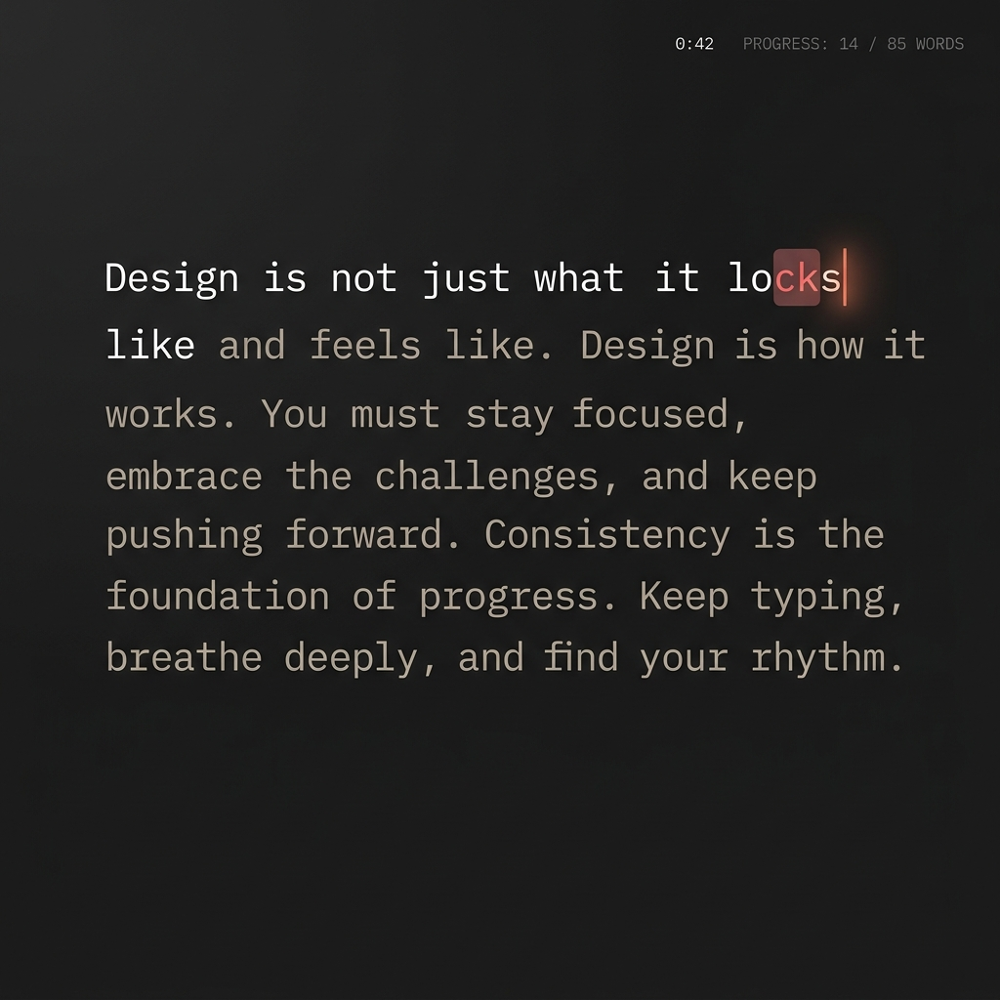
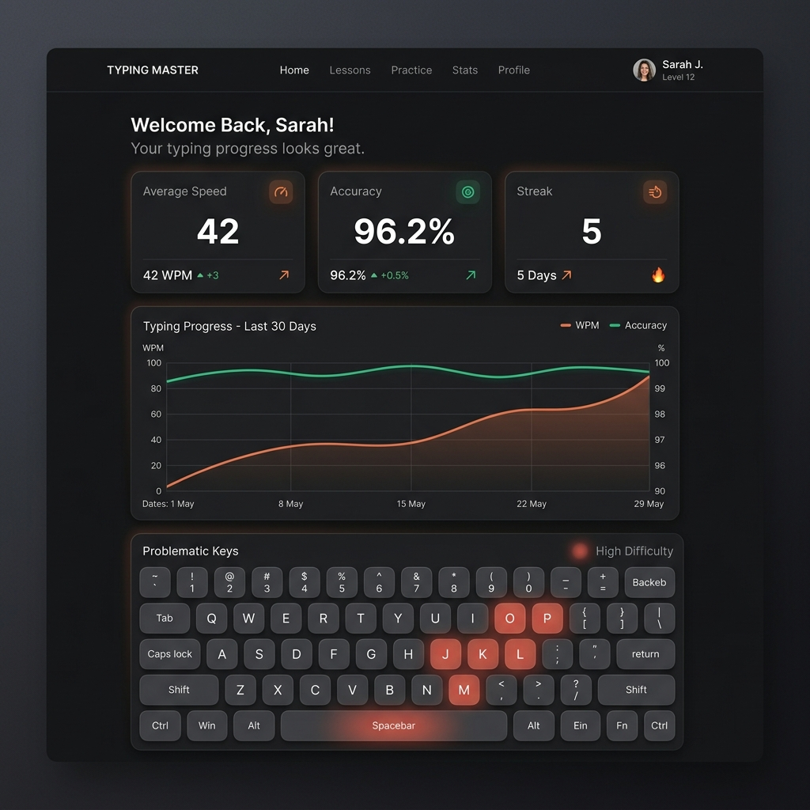

# Itype ⌨️

Itype is a warm, minimalist desktop typing tutor designed to help you master touch typing with a clean, distraction-free environment. Built with Vite, React, TailwindCSS, and Electron, it stores all your local profiles, typing histories, custom decks, and achievement badges inside a local SQLite database.

## Preview

### Distraction-Free Practice View
A minimalist dark-mode typing interface featuring an inline progress header and a terracota orange accent cursor.



### Performance Stats & Insights
Review session curves showing second-by-second WPM and accuracy metrics, along with an interactive problem-key heatmap overlay and an AI Typing Coach suggestion box.



---

## Features

- **Distraction-Free Typing Header**: Replaces bulky panels with a tiny, low-contrast inline metadata bar (Time and word progress `14 / 85 words`) to eliminate typing anxiety.
- **Whole-Word Wrapping**: Monkeytype-style layouts where words never get split across lines mid-word.
- **Acoustic Synthesizer Click Profiles**: Switch between three real-time synthesized keyclick sounds:
  - *Clicky*: Crisp Cherry MX mechanical switches.
  - *Soft*: Warm, rounded bubble-wrap pops.
  - *Vintage*: Heavy typewriter metal taps.
- **Structured Progressive Stepper**: 4 Chapters (Home Row, Top Row, Bottom Row, Capitalization) with 5 progressive steps (Key, Rhythm, Word, Sentence, and Chapter Test).
- **Chapter progression gates**: Chapter Tests enforce a strict threshold of **15 WPM and 90% Accuracy** to unlock the subsequent chapter.
- **AI Typing Coach**: Automatically identifies your top 4 weakest characters from your cumulative SQLite heatmap and compiles a custom 30-word practice drill targeting those exact keys.
- **Quick Practice Generator**: Build randomized word flows to test pacing. Toggle time trials (15s, 30s, 60s) or word counts (10, 25, 50, 100), with punctuation and digit-row row injections.
- **Expanded Custom Library**: Includes coding essays (JavaScript algorithms and React HTML layout sheets) to practice brackets, semicolons, and operator reaches, plus classic literature passages (Alice in Wonderland, Sherlock Holmes).
- **Color Accent Themes**: Instantly change color themes across Terracotta (Orange), Forest (Sage Green), Oasis (Teal), and Sand (Gold). 
- **SQLite Persistence**: Local profiles, badge unlocks, custom deck lists, and typing speeds persist offline.

---

## Getting Started

### Prerequisites
Make sure you have Node.js installed on your machine.

### Installation

1. Clone the repository:
   ```bash
   git clone https://github.com/yourusername/Itype.git
   cd Itype
   ```

2. Install dependencies:
   ```bash
   npm install
   ```

3. Launch the development server (browser preview):
   ```bash
   npm run dev
   ```

4. Launch the desktop Electron application (runs local SQLite database):
   ```bash
   npm run electron
   ```

5. Build the production package:
   ```bash
   npm run build
   ```

---

## Tech Stack

- **Framework**: React + TypeScript
- **Styling**: TailwindCSS (v4)
- **Desktop Container**: Electron
- **Database**: SQLite (via sql.js client-side interface)
- **Audio Synthesizer**: Web Audio API (Oscillators for customized keyclick acoustics)
- **Charts**: Recharts (Timeline speed curves and accuracy charts)
- **Icons**: Lucide React
