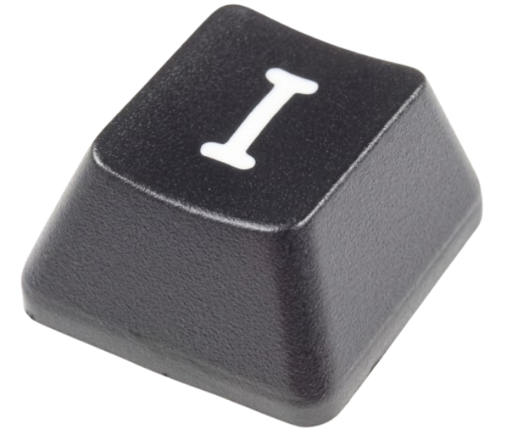
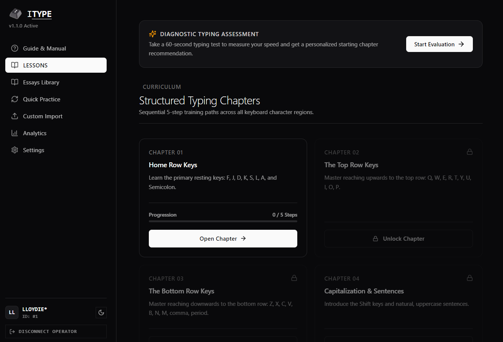
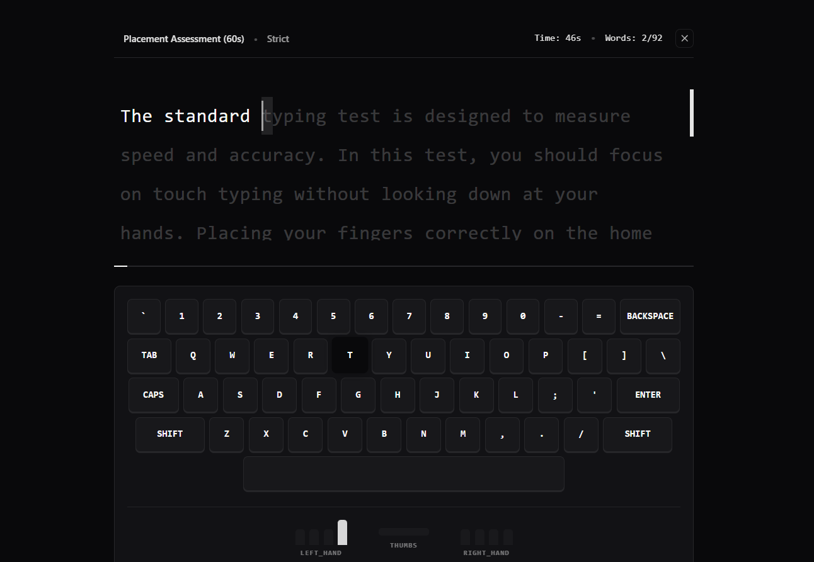
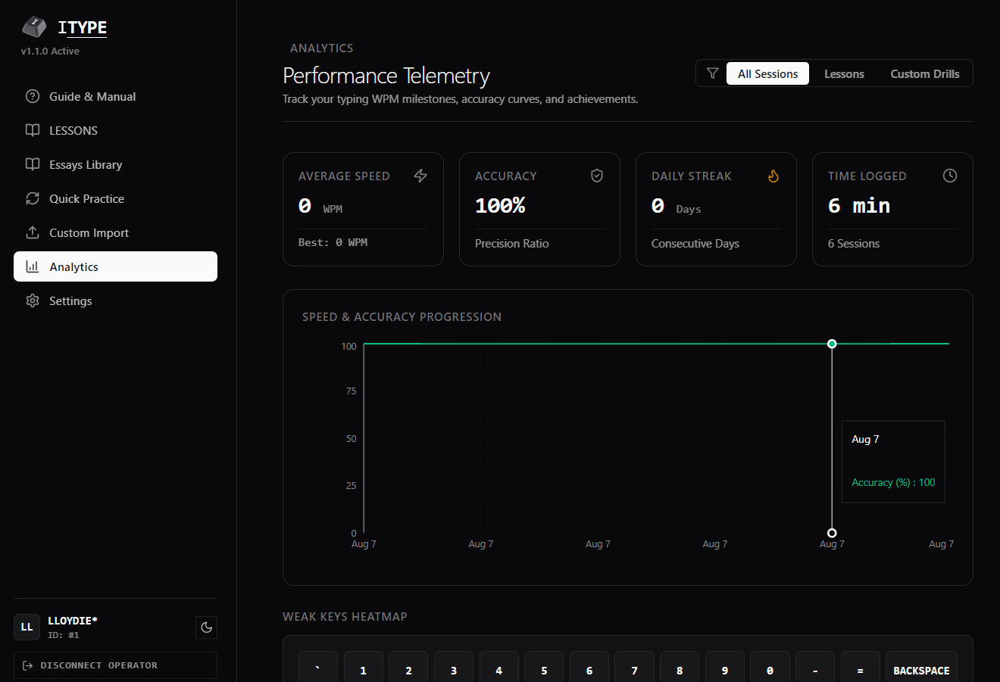

<div align="center">
  
  <h1>Itype </h1>
  <p><strong>Learn to Type, Your Way</strong></p>
  <p>A modern, distraction-free touch typing practice and learning engine built for Windows.</p>
</div>

---

##  Overview

**Itype** is an offline-first desktop application designed to guide typists from home-row fundamentals to complete keyboard mastery. Powered by Electron, React, TypeScript, TailwindCSS, and SQLite, Itype combines structured progressive lessons with custom practice imports—allowing you to practice with your own study notes, source code snippets, or literature passages.

---

##  Screenshots

###  LESSONS Curriculum & Step Progression
*Explore 7 comprehensive chapters and 35 progressive steps with visual milestone badges.*



---

###  Distraction-Free Practice View
*Clean typing canvas featuring live WPM, accuracy metrics, dynamic caret animations, and interactive keyboard finger placement maps.*



---

###  Performance Analytics & History
*Analyze your second-by-second WPM progression curves, accuracy trends, and cumulative problem-key heatmaps.*



---

##  Features

-  **7-Chapter Progressive Curriculum**: 35 step-by-step drills taking you from home-row basics, top/bottom rows, numbers, code symbols, up to speed endurance.
-  **Custom Practice & Essays Library**: Import custom text files, paste study notes, or practice built-in literature passages and JavaScript code snippets.
-  **Monochrome Redesign & Dark Mode Tones**: Clean aesthetic with 5 customizable dark mode background levels (*Pitch Black OLED*, *Obsidian*, *Soft Charcoal*, *Deep Slate*, and *Muted Dusk*).
-  **WebAudio Tactile Acoustics**: Real-time synthesized keyclick audio profiles (*Cherry MX Clicky*, *Aggressive Clack*, *Bubble Pop*, and *Typewriter Bell*).
-  **18 Achievements Matrix & Streaks**: Gamified milestone badges (*Godspeed 120+ WPM*, *Sharpshooter*, *Centurion*, *Night Owl*) and daily practice streak counters.
-  **Universal Keyboard Navigation**: Press **Space** or **Enter** to start drills and seamlessly proceed between lessons.
-  **100% Offline SQLite Persistence**: User profiles, typing history, badges, and settings remain stored on your device.

---

##  Getting Started

### Installation (Pre-built Windows Desktop App)

1. Download **`Itype Setup 1.1.1.exe`** from the [Latest Releases](https://github.com/LOYDIE8/Itype/releases) page.
2. Double-click the installer executable to install.
3. Launch **Itype** and begin your practice!

---

### Building from Source

#### Prerequisites
- [Node.js](https://nodejs.org/) (v18 or higher)
- npm package manager

#### Setup Steps

1. Clone the repository:
   ```bash
   git clone https://github.com/LOYDIE8/Itype.git
   cd Itype
   ```

2. Install dependencies:
   ```bash
   npm install
   ```

3. Launch development mode (Vite + Electron):
   ```bash
   npm run dev
   ```

4. Build production desktop installer package:
   ```bash
   npm run package
   ```

---

## 🛠️ Tech Stack

- **Framework**: React 19 + TypeScript
- **Styling**: TailwindCSS (v4)
- **Desktop Runtime**: Electron
- **Database**: SQLite (`sql.js`)
- **Audio Synthesizer**: Web Audio API (Oscillators & noise generators)
- **Data Visualization**: Recharts
- **Icons**: Lucide React
